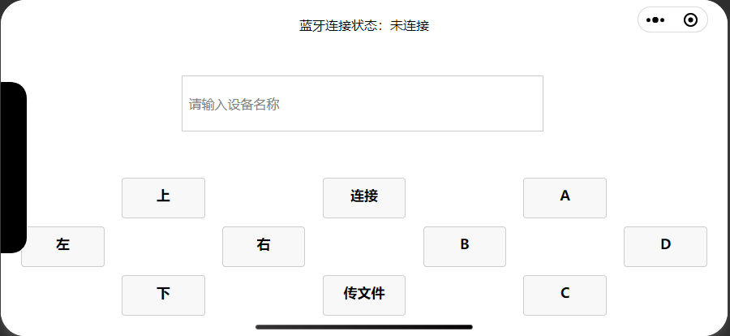
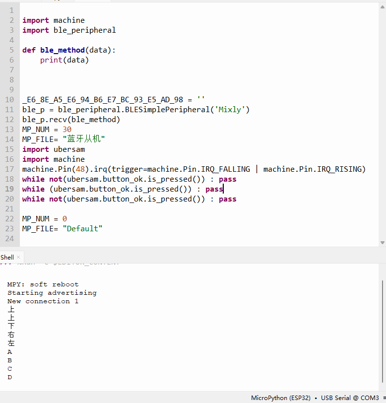

# 微信小程序项目 - 蓝牙设备控制器  
**WeChat Mini Program Project - Bluetooth Device Controller**

## 项目简介  
**Project Introduction**  
蓝牙设备控制器是一款基于微信小程序开发的工具，旨在帮助用户通过微信小程序搜索和连接蓝牙设备。
用户可以通过此小程序快速查找并连接到特定的蓝牙设备。
支持设备名称过滤和自动连接等功能。我用它来与ESP32设备通信。
Bluetooth Device Controller is a tool developed as a WeChat Mini Program, designed to help users search and connect to Bluetooth devices through the mini program. Users can quickly find and connect to specific Bluetooth devices, with features such as device name filtering and automatic connection.I use it for ESP32.

## 功能特点  
**Features**  
- **蓝牙设备搜索**：可以搜索周围的所有蓝牙设备，并在后台显示设备名称列表。  
- **设备名称过滤**：支持通过输入设备名称进行筛选，精确定位目标设备。  
- **连接状态提示**：在连接成功或失败时提供实时反馈。  

- **Bluetooth Device Discovery**: Search for all nearby Bluetooth devices and display a list of device names.  
- **Device Name Filtering**: Support filtering by entering the device name to precisely locate the target device.  
- **Connection Status Feedback**: Provide real-time feedback when the connection succeeds or fails.

## 安装与使用  
**Installation & Usage**  
1. 确保您已安装微信开发者工具。  
2. 克隆或下载本项目到本地。  
3. 使用微信开发者工具打开项目文件夹。  
4. 在 `app.json` 文件中配置您的 AppID。  
5. 点击 "编译" 按钮运行小程序。  

1. Ensure you have WeChat Developer Tools installed.  
2. Clone or download this project to your local machine.  
3. Open the project folder using WeChat Developer Tools.  
4. Configure your AppID in the `app.json` file.  
5. Click the "Compile" button to run the mini program.

## 代码结构  
**Code Structure**  
- `pages/index/index.js`：主要的业务逻辑代码，包括蓝牙设备搜索和连接功能。  
- `pages/index/index.wxml`：页面的结构文件，定义了小程序的 UI 布局。  
- `pages/index/index.wxss`：页面的样式文件，定义了小程序的 CSS 样式。  
- `app.js`：小程序的全局逻辑代码。  
- `app.json`：小程序的配置文件，定义了页面路径、窗口表现等。  
- `app.wxss`：小程序的全局样式文件。

- `pages/index/index.js`: Main business logic code, including Bluetooth device discovery and connection functions.  
- `pages/index/index.wxml`: Structure file for the page, defining the UI layout of the mini program.  
- `pages/index/index.wxss`: Style file for the page, defining the CSS styles of the mini program.  
- `app.js`: Global logic code for the mini program.  
- `app.json`: Configuration file for the mini program, defining page paths, window behaviors, etc.  
- `app.wxss`: Global style file for the mini program.

## 注意事项  
**Notes**  
- 确保设备蓝牙已开启，并已授权小程序使用蓝牙功能（安卓中蓝牙权限与位置权限绑定，因此需要同时打开位置和蓝牙）。  
- 该小程序在部分设备上可能需要额外的权限设置，请根据提示进行操作。  
- 如果需要调试，请使用真机调试功能，确保蓝牙功能能够正常使用。

- Ensure Bluetooth is enabled on the device and the mini program has been granted permission to use Bluetooth.  
- This mini program may require additional permission settings on some devices, please follow the prompts.  
- For debugging purposes, use the real device debugging feature to ensure Bluetooth functionality works properly.

